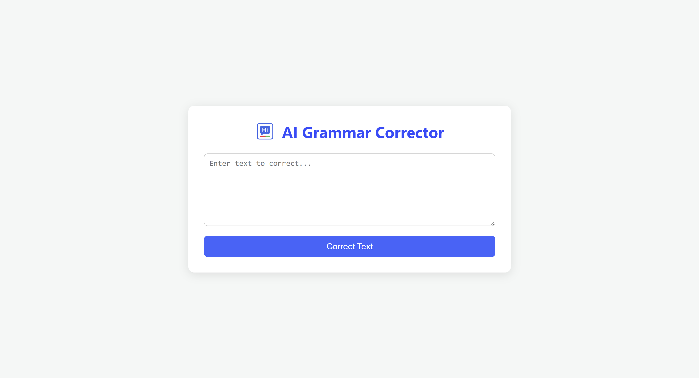

# AI Grammar Corrector

[](https://ai-grammar-corrector-sf9w.onrender.com)
[](https://nodejs.org/)
[](https://expressjs.com/)
[](https://ejs.co/)

A simple yet powerful web application that corrects grammar and spelling mistakes in any given text using the Google Gemini API. This project is built with Node.js and Express, and features a clean, responsive user interface rendered with EJS.

## Project Screenshot



## Features

-   **Instant Grammar Correction:** Leverages the powerful Google Gemini API to provide accurate corrections for spelling and grammar.
-   **Preserves Line Breaks:** The AI is specifically instructed to process each line independently, maintaining the original structure of the input text.
-   **Clean & Responsive UI:** A simple, intuitive interface that works seamlessly on both desktop and mobile devices.
-   **Professional Branding:** Includes a custom logo and a comprehensive set of favicons for a polished user experience across all platforms and devices.
-   **Well-Documented Code:** The entire codebase is thoroughly commented for easy understanding and maintenance.

## Tech Stack

-   **Backend:** Node.js, Express.js
-   **Frontend:** EJS (Embedded JavaScript), HTML5, CSS3
-   **API:** Google Gemini API
-   **Deployment:** Render

## Installation and Setup

To run this project on your local machine, follow these steps:

1.  **Clone the repository:**
    ```
    git clone https://github.com/YOUR_USERNAME/ai-grammar-corrector.git
    ```

2.  **Navigate to the project directory:**
    ```
    cd ai-grammar-corrector
    ```

3.  **Install the dependencies:**
    ```
    npm install
    ```

4.  **Create your environment file:**
    -   Create a new file in the root of the project named `.env`.
    -   Add your Google Gemini API key to this file:
        ```
        GEMINI_API_KEY=YOUR_API_KEY_HERE
        ```
    -   You can get your free API key from [Google AI Studio](https://aistudio.google.com/app/apikey).

5.  **Start the server:**
    ```
    npm start
    ```
    The application will be running at `http://localhost:3000`.

## Usage

1.  Navigate to the [Live Demo](https://ai-grammar-corrector-sf9w.onrender.com) or your local server.
2.  Enter the text you want to correct into the textarea.
3.  Click the "Correct Text" button.
4.  The corrected version will appear below, preserving the original line breaks.
